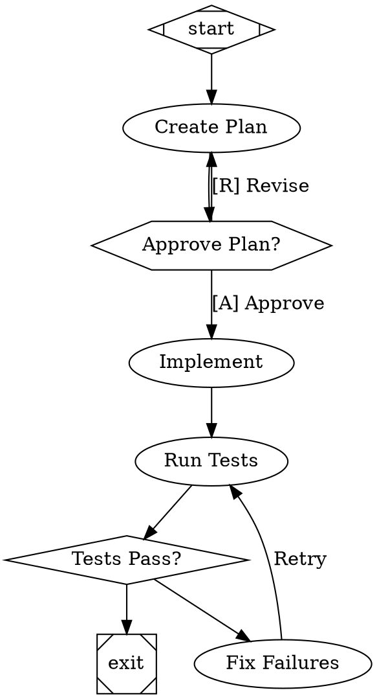

# Research: AI Workflow Orchestration Approaches

**Date**: 2026-03-03
**Status**: Reference
**Sources**:
- [Attractor](https://github.com/strongdm/attractor) — StrongDM's pipeline orchestration specs
- [Spec-Kit](https://github.com/github/spec-kit) — GitHub's specification-driven development framework
- [StrongDM Software Factory blog post](https://www.strongdm.com/blog/the-strongdm-software-factory-building-software-with-ai)

---

## Context

This document captures research into two open-source projects that tackle AI-assisted software development workflows, and how their ideas relate to Weave's architecture.

---

## 1. Attractor (StrongDM)

### What It Is

Attractor is a set of three **Natural Language Specifications (NLSpecs)** — not a tool or library, but spec documents designed to be handed to a coding agent with "implement this." It defines a three-layer stack for AI-powered software workflows.

### Three-Layer Architecture

| Layer | Spec | Purpose |
|-------|------|---------|
| **3 (Top)** | `attractor-spec.md` | Pipeline orchestration — define multi-stage workflows as Graphviz DOT graphs |
| **2 (Mid)** | `coding-agent-loop-spec.md` | Agentic loop — turn-based agent execution with tools, steering, loop detection |
| **1 (Bottom)** | `unified-llm-spec.md` | LLM abstraction — single interface across OpenAI, Anthropic, Gemini |

### Core Concept: Pipelines as Directed Graphs

Workflows are defined in **Graphviz DOT syntax** where nodes are tasks and edges are transitions with conditions:



### Key Mechanisms

| Mechanism | Description |
|-----------|-------------|
| **Node Types** | `Mdiamond` (start), `Msquare` (exit), `box` (LLM task), `hexagon` (human gate), `diamond` (conditional), `component` (parallel fan-out), `tripleoctagon` (fan-in), `parallelogram` (tool), `house` (supervisor loop) |
| **Edge Selection** | 5-step deterministic algorithm: condition match → preferred label → suggested next → highest weight → lexical tiebreak |
| **Goal Gates** | Nodes with `goal_gate=true` must succeed before pipeline can exit |
| **Retry Policies** | Per-node `max_retries` with backoff strategies: exponential (default), linear, custom. Presets: `none`, `standard`, `aggressive`, `linear`, `patient` |
| **Context Fidelity** | 6 modes controlling history flow between nodes: `full`, `truncate`, `compact`, `summary:low`, `summary:medium`, `summary:high` |
| **Parallel Execution** | Fan-out with join policies: `wait_all`, `k_of_n`, `first_success`, `quorum` |
| **Checkpointing** | Full context snapshots after each node for resume capability |
| **Human-in-the-Loop** | `hexagon` nodes pause execution, present choices from outgoing edge labels |
| **Model Stylesheet** | CSS-like rules for centralized LLM model/provider configuration per node class or ID |

### StrongDM Software Factory Philosophy

From the blog post: "Humans define intent — what the system should do, the scenarios it needs to handle, the constraints that matter. After that, the agents take it from there." Key claim: **"Validation replaces code review."** They use scenario-based validation against "Digital Twin" systems (simulated Okta, Slack, etc.) to verify AI-generated code without human review.

---

## 2. Spec-Kit (GitHub)

### What It Is

A **CLI + template system** for Specification-Driven Development (SDD). The core insight: **specifications should be the executable source of truth**, with code as the output — not the other way around.

### The Workflow

```
Constitution → Specify → Clarify → Plan → Tasks → Implement
```

| Step | Command | Output | Purpose |
|------|---------|--------|---------|
| Constitution | `/speckit.constitution` | `constitution.md` | Immutable architectural principles (TDD, simplicity, max projects) |
| Specify | `/speckit.specify` | `spec.md` | User stories, requirements, acceptance criteria — **no tech decisions** |
| Clarify | `/speckit.clarify` | Updates to `spec.md` | Resolve `[NEEDS CLARIFICATION]` markers via structured Q&A |
| Plan | `/speckit.plan` | `plan.md`, `data-model.md`, `contracts/`, `research.md` | Architecture, tech stack, constitutional gate checks |
| Tasks | `/speckit.tasks` | `tasks.md` | Ordered task list with `[P]` parallel markers, phases, dependencies |
| Implement | `/speckit.implement` | Working code | Execute tasks sequentially, TDD, mark `[X]` on completion |

### Key Concepts

| Concept | Description |
|---------|-------------|
| **Constitution** | Immutable architectural principles governing all development. 9 articles covering library-first, TDD, simplicity, anti-abstraction, etc. |
| **Spec ≠ Plan Separation** | Specs describe *what* (user stories, acceptance criteria) without tech decisions. Plans describe *how* (architecture, data models, contracts). Forces structured thinking. |
| **Constitutional Gates** | Embedded checkboxes in plans: "Using ≤3 projects?", "No future-proofing?", "Using framework directly?" AI must self-validate. |
| **Feature Numbering** | Auto-incrementing feature IDs (`001-auth`, `002-dashboard`) with dedicated directories and Git branches. |
| **`[NEEDS CLARIFICATION]` Markers** | Force AI to flag uncertainties rather than guess. Max 3 allowed before clarification is required. |
| **`[P]` Parallel Markers** | Advisory markers on tasks that can run concurrently (different files, no dependencies). |
| **Cross-Artifact Analysis** | `/speckit.analyze` validates alignment between specs, plans, and tasks. |
| **Multi-Agent Portability** | Works with 16+ coding agents (Claude, Gemini, Copilot, Cursor, OpenCode, etc.) via slash commands. |

### Project Structure

```
specs/
  001-feature-name/
    spec.md           # What to build (user stories, requirements)
    plan.md           # How to build it (architecture, data models)
    data-model.md     # Entities, relationships, state transitions
    research.md       # Technical investigation, decisions, alternatives
    contracts/        # API specs, event schemas, CLI interfaces
    tasks.md          # Ordered, phased task list
    quickstart.md     # Integration validation scenarios
.specify/
  memory/
    constitution.md   # Immutable project principles
  scripts/            # Feature numbering, context updates
  templates/          # Spec, plan, task templates
```

---

## 3. Three-Way Comparison

### Core Philosophies

| | Philosophy | Analogy |
|---|---|---|
| **Spec-Kit** | Structure the *thinking*. Rigorous methodology before code. | Architect's process manual |
| **Attractor** | Structure the *execution*. Deterministic, visual pipeline. | Factory assembly line blueprint |
| **Weave** | Structure the *team*. Specialists collaborate with governance. | Managed team with roles and permissions |

### Feature Comparison

| Dimension | **Spec-Kit** | **Attractor** | **Weave** |
|-----------|-------------|---------------|-----------|
| **Primary artifact** | Markdown specs, plans, task lists | DOT graph files | Markdown plans with `- [ ]` checkboxes |
| **What it structures** | The *thinking* before coding | The *execution* of a pipeline | The *delegation and execution* of work |
| **Branching/routing** | Implicit (sequential phases) | Explicit (edge conditions, weights) | Agent judgment (LLM decides) |
| **Human gates** | Between phases (user runs next command) | `hexagon` nodes pause execution | User runs `/start-work`, reviews output |
| **Retry logic** | None formal | Per-node policies with backoff | Agent-level (informal) |
| **Parallelism** | `[P]` markers on tasks (advisory) | `parallel` handler with join policies | Fleet child sessions |
| **State persistence** | Git-versioned specs in `specs/` | Checkpoint records with context snapshots | `.weave/state.json` |
| **Quality gates** | Constitutional checks, checklists | Goal gates (must-succeed nodes) | Weft/Warp review agents |
| **Context management** | Phase separation prevents context overload | 6 fidelity modes (full → truncate) | Context window monitoring (80%/95%) |
| **Agent support** | 16+ agents (agent-agnostic) | Agent-agnostic (spec only) | OpenCode plugin (8 specialized agents) |
| **Visualization** | None (markdown) | DOT renders to images, diffable in PRs | None (markdown) |

---

## 4. Ideas Worth Adopting in Weave

### From Spec-Kit

#### 4.1 The Constitution Concept ⭐⭐⭐
A project-level `constitution.md` (e.g., `.weave/constitution.md` or `.opencode/constitution.md`) that Pattern must read and validate against when generating plans. Not a per-session skill — a permanent, versioned artifact checked into the repo.

**Example**: "This project uses TDD. Max 3 services. No ORMs. Use framework APIs directly. All public APIs must have integration tests."

Pattern already writes plans to `.weave/plans/`. A constitution would add meaningful, persistent guardrails without changing architecture.

#### 4.2 Spec ≠ Plan Separation ⭐⭐
Currently Pattern blends requirements with implementation details. Spec-Kit's insight: specifying *what* (user stories, acceptance criteria) separately from *how* (architecture, tech decisions) prevents premature implementation.

Could manifest as a two-phase Pattern workflow: first generate a spec in `.weave/specs/`, then generate a plan in `.weave/plans/` that references it.

#### 4.3 Cross-Artifact Analysis ⭐⭐
A Weft capability to check whether plan tasks cover all spec requirements, whether implementation matches the plan's contracts, etc. Currently Weft reviews code changes; it could also review spec-plan-task alignment.

#### 4.4 Feature-Level Organization ⭐
Numbered features with dedicated directories (`specs/001-auth/`) is clean for multi-feature projects. Weave's `.weave/plans/` is flat — no feature grouping, numbering, or branch association.

#### 4.5 Constitutional Gate Checks in Plans ⭐
Spec-Kit embeds explicit checkboxes in plans: "Using ≤3 projects?", "No future-proofing?", "Using framework directly?" These force the AI to self-validate against principles. Pattern could adopt this.

#### 4.6 `[NEEDS CLARIFICATION]` Markers ⭐
Forcing Pattern to flag uncertainties rather than guess. Max 3 markers before clarification is required. Better than the AI silently making assumptions.

### From Attractor

#### 4.7 Declarative Branching in Plans ⭐⭐⭐
Weave's plans are linear task lists. Attractor's conditional edges let workflows branch deterministically. Plans could include explicit failure paths and retry loops: "If tests fail → fix → re-run (max 3 times)" rather than hoping Tapestry handles it.

#### 4.8 Goal Gates ⭐⭐⭐
`goal_gate=true` means the pipeline cannot exit unless that node succeeded. Weave has no equivalent — if Tapestry checks a box but the test actually failed, the plan proceeds. Adding goal gates would add formal correctness guarantees.

#### 4.9 Context Fidelity Controls ⭐⭐
6 fidelity modes (full, truncate, compact, summary:low/medium/high) are more sophisticated than Weave's reactive context window monitor. Declaring upfront "this task gets a fresh context with only a compact summary" would help manage token budgets proactively.

#### 4.10 Structured Retry Policies ⭐⭐
Per-task retry policies with backoff strategies instead of hoping the agent retries on failure. Plans could specify: "Run tests: max 3 retries with exponential backoff."

#### 4.11 Parallel Join Policies ⭐
Fleet already supports child sessions. Attractor adds join policies (wait_all, k_of_n, first_success, quorum) that would make Fleet orchestration more declarative.

### What NOT to Adopt

| Concept | Why Not |
|---------|---------|
| DOT syntax | Heavyweight; markdown checkboxes are simpler for LLMs to generate and consume. The *concepts* (branching, gates, fidelity) are valuable, not the file format. |
| Unified LLM SDK | Weave delegates this to OpenCode's provider system. |
| Coding Agent Loop spec | Weave's agent loop via OpenCode already handles this with hooks, tool permissions, and steering. |
| Multi-agent portability (Spec-Kit) | Weave is purpose-built for OpenCode. Supporting 16+ agents would dilute focus. |
| Full SDD methodology | Too prescriptive for Weave's use cases. Cherry-pick the best ideas instead. |

---

## 5. Potential Integration Paths

### Near-Term (Low Effort, High Value)
1. **Add constitution support** — Pattern reads `.weave/constitution.md` if present, validates plans against it
2. **Add `[NEEDS CLARIFICATION]` convention** — Pattern flags uncertainties instead of guessing
3. **Add goal gate markers to plans** — `- [ ] [GATE] Run full test suite` syntax that Tapestry enforces

### Medium-Term (Moderate Effort)
4. **Structured retry syntax in plans** — `- [ ] Run tests (max_retries: 3)` parsed by Tapestry
5. **Failure paths in plans** — "If step N fails → jump to step M" notation
6. **Spec-then-plan workflow** — Pattern generates spec first, then plan referencing it

### Long-Term (Exploratory)
7. **Context fidelity per task** — Tapestry manages context window proactively based on task annotations
8. **Visual plan rendering** — Generate Mermaid/DOT diagrams from plans for PR review
9. **Cross-artifact analysis** — Weft validates spec → plan → code alignment

---

## 6. Key Takeaways

1. **Spec-Kit, Attractor, and Weave are complementary, not competitive.** They operate at different layers: methodology (Spec-Kit), execution engine (Attractor), and agent orchestration (Weave).

2. **The highest-value ideas to borrow are conceptual, not implementational.** Constitutions, goal gates, declarative branching, and context fidelity would all improve Weave without changing its fundamental architecture.

3. **Markdown remains the right format for Weave.** DOT is powerful but adds complexity. The lesson is to enrich markdown plans with structured semantics (gates, retries, failure paths) rather than switching formats.

4. **Spec-Kit's separation of "what" from "how"** is an underappreciated insight that could significantly improve Pattern's output quality.

5. **StrongDM's "validation replaces code review"** claim is aspirational but directionally correct. Weave's Weft/Warp review agents are already a step in this direction — they could evolve toward scenario-based validation.
