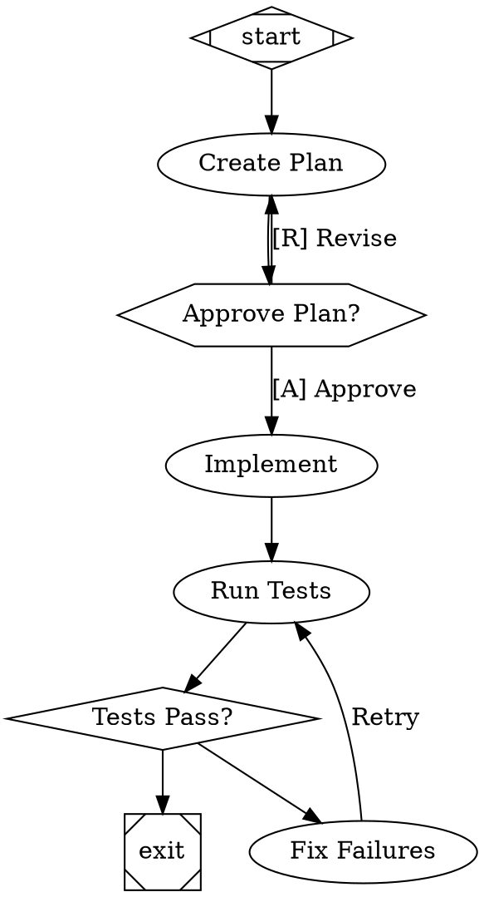

# Research: AI Workflow Orchestration Approaches

**Date**: 2026-03-03
**Status**: Reference
**Sources**:
- [Attractor](https://github.com/strongdm/attractor) — StrongDM's pipeline orchestration specs
- [Spec-Kit](https://github.com/github/spec-kit) — GitHub's specification-driven development framework
- [StrongDM Software Factory blog post](https://www.strongdm.com/blog/the-strongdm-software-factory-building-software-with-ai)

---

## Context

This document captures research into two open-source projects that tackle AI-assisted software development workflows, and how their ideas relate to Weave's architecture. The key discovery: **Attractor is a harness (same layer as OpenCode), while Spec-Kit is a planning methodology (same layer as Pattern)**. Understanding which layer each tool operates at clarifies exactly what's worth borrowing.

---

## 0. The Key Insight: Where Each Tool Sits in the Stack

These three projects aren't competing — they operate at **completely different layers**:

| Tool | What it actually is | Layer | Analogy |
|------|-------------------|-------|---------|
| **Attractor** | A harness — the agent loop, tools, orchestration | **Runtime/execution** | The factory floor |
| **Spec-Kit** | A planning methodology — structured thinking before code | **Pre-execution planning** | The architect's process manual |
| **OpenCode** | A harness (same layer as Attractor) | **Runtime/execution** | The factory floor |
| **Weave** | Team structure + orchestration on top of OpenCode | **Runtime/execution + roles** | The managed team |

### Attractor ≈ OpenCode (they're the same thing)

Attractor is a **spec you hand to a raw LLM** to bootstrap an entire harness from scratch — the agent loop, tool use, file management, error recovery. If you already use OpenCode, you already *have* what Attractor builds. Its bottom two layers (unified LLM client + coding agent loop) are literally reimplementing what OpenCode gives you for free.

The only novel layer is the **pipeline orchestration** on top — and even that overlaps heavily with what Weave's Fleet API already does (spawn parallel sessions, callbacks, worktrees). The interesting bits that survive this realization are narrow: goal gates, context fidelity modes, deterministic edge selection, structured retry policies.

### Spec-Kit ≈ A More Structured Pattern

Spec-Kit doesn't execute anything. It's a CLI that helps you write structured documents — constitutions, specs, plans — in a specific order. It's a **workflow for humans and AI to think clearly** before implementation begins.

The closest analog in Weave is **Pattern**. Pattern does the "think before you code" step. But Pattern is freeform, while Spec-Kit enforces a rigid pipeline:

```
Constitution → Specify → Clarify → Plan → Tasks → Implement
```

The real question becomes: **should Pattern adopt Spec-Kit's structured stages?** Right now Pattern produces a plan in one shot. Spec-Kit would say that's skipping steps — you should first write a spec (the *what*), then clarify ambiguities, *then* plan (the *how*).

The most practical pieces to borrow: `[NEEDS CLARIFICATION]` markers (flag unknowns instead of guessing) and the constitution concept (persistent architectural guardrails that constrain planning).

### What This Means for Weave

Given this framing, the borrowable ideas are much narrower than they first appear:

- **From Attractor**: Only the orchestration *concepts* matter (goal gates, retry policies, context fidelity) — not the implementation, since OpenCode already provides the runtime.
- **From Spec-Kit**: The planning *methodology* matters (constitutions, spec/plan separation, clarification markers) — not the CLI or template system.
- **Weave's unique value**: The team structure (specialized agents with roles and permissions) is something neither Attractor nor Spec-Kit provides. This is where Weave should double down.

---

## 1. Attractor (StrongDM)

### What It Is

Attractor is a set of three **Natural Language Specifications (NLSpecs)** — not a tool or library, but spec documents designed to be handed to a coding agent with "implement this." It defines a three-layer stack for AI-powered software workflows. **In practice, it's building a harness — the same thing OpenCode already is.**

### Three-Layer Architecture

| Layer | Spec | Purpose |
|-------|------|---------|
| **3 (Top)** | `attractor-spec.md` | Pipeline orchestration — define multi-stage workflows as Graphviz DOT graphs |
| **2 (Mid)** | `coding-agent-loop-spec.md` | Agentic loop — turn-based agent execution with tools, steering, loop detection |
| **1 (Bottom)** | `unified-llm-spec.md` | LLM abstraction — single interface across OpenAI, Anthropic, Gemini |

### Core Concept: Pipelines as Directed Graphs

Workflows are defined in **Graphviz DOT syntax** where nodes are tasks and edges are transitions with conditions:



### Key Mechanisms

| Mechanism | Description |
|-----------|-------------|
| **Node Types** | `Mdiamond` (start), `Msquare` (exit), `box` (LLM task), `hexagon` (human gate), `diamond` (conditional), `component` (parallel fan-out), `tripleoctagon` (fan-in), `parallelogram` (tool), `house` (supervisor loop) |
| **Edge Selection** | 5-step deterministic algorithm: condition match → preferred label → suggested next → highest weight → lexical tiebreak |
| **Goal Gates** | Nodes with `goal_gate=true` must succeed before pipeline can exit |
| **Retry Policies** | Per-node `max_retries` with backoff strategies: exponential (default), linear, custom. Presets: `none`, `standard`, `aggressive`, `linear`, `patient` |
| **Context Fidelity** | 6 modes controlling history flow between nodes: `full`, `truncate`, `compact`, `summary:low`, `summary:medium`, `summary:high` |
| **Parallel Execution** | Fan-out with join policies: `wait_all`, `k_of_n`, `first_success`, `quorum` |
| **Checkpointing** | Full context snapshots after each node for resume capability |
| **Human-in-the-Loop** | `hexagon` nodes pause execution, present choices from outgoing edge labels |
| **Model Stylesheet** | CSS-like rules for centralized LLM model/provider configuration per node class or ID |

### StrongDM Software Factory Philosophy

From the blog post: "Humans define intent — what the system should do, the scenarios it needs to handle, the constraints that matter. After that, the agents take it from there." Key claim: **"Validation replaces code review."** They use scenario-based validation against "Digital Twin" systems (simulated Okta, Slack, etc.) to verify AI-generated code without human review.

---

## 2. Spec-Kit (GitHub)

### What It Is

A **CLI + template system** for Specification-Driven Development (SDD). The core insight: **specifications should be the executable source of truth**, with code as the output — not the other way around.

### The Workflow

```
Constitution → Specify → Clarify → Plan → Tasks → Implement
```

| Step | Command | Output | Purpose |
|------|---------|--------|---------|
| Constitution | `/speckit.constitution` | `constitution.md` | Immutable architectural principles (TDD, simplicity, max projects) |
| Specify | `/speckit.specify` | `spec.md` | User stories, requirements, acceptance criteria — **no tech decisions** |
| Clarify | `/speckit.clarify` | Updates to `spec.md` | Resolve `[NEEDS CLARIFICATION]` markers via structured Q&A |
| Plan | `/speckit.plan` | `plan.md`, `data-model.md`, `contracts/`, `research.md` | Architecture, tech stack, constitutional gate checks |
| Tasks | `/speckit.tasks` | `tasks.md` | Ordered task list with `[P]` parallel markers, phases, dependencies |
| Implement | `/speckit.implement` | Working code | Execute tasks sequentially, TDD, mark `[X]` on completion |

### Key Concepts

| Concept | Description |
|---------|-------------|
| **Constitution** | Immutable architectural principles governing all development. 9 articles covering library-first, TDD, simplicity, anti-abstraction, etc. |
| **Spec ≠ Plan Separation** | Specs describe *what* (user stories, acceptance criteria) without tech decisions. Plans describe *how* (architecture, data models, contracts). Forces structured thinking. |
| **Constitutional Gates** | Embedded checkboxes in plans: "Using ≤3 projects?", "No future-proofing?", "Using framework directly?" AI must self-validate. |
| **Feature Numbering** | Auto-incrementing feature IDs (`001-auth`, `002-dashboard`) with dedicated directories and Git branches. |
| **`[NEEDS CLARIFICATION]` Markers** | Force AI to flag uncertainties rather than guess. Max 3 allowed before clarification is required. |
| **`[P]` Parallel Markers** | Advisory markers on tasks that can run concurrently (different files, no dependencies). |
| **Cross-Artifact Analysis** | `/speckit.analyze` validates alignment between specs, plans, and tasks. |
| **Multi-Agent Portability** | Works with 16+ coding agents (Claude, Gemini, Copilot, Cursor, OpenCode, etc.) via slash commands. |

### Project Structure

```
specs/
  001-feature-name/
    spec.md           # What to build (user stories, requirements)
    plan.md           # How to build it (architecture, data models)
    data-model.md     # Entities, relationships, state transitions
    research.md       # Technical investigation, decisions, alternatives
    contracts/        # API specs, event schemas, CLI interfaces
    tasks.md          # Ordered, phased task list
    quickstart.md     # Integration validation scenarios
.specify/
  memory/
    constitution.md   # Immutable project principles
  scripts/            # Feature numbering, context updates
  templates/          # Spec, plan, task templates
```

---

## 3. Three-Way Comparison

### Core Philosophies

See **Section 0** for the architectural framing. In summary:

- **Attractor** ≈ OpenCode (both are harnesses — Attractor reimplements what OpenCode already provides)
- **Spec-Kit** ≈ Pattern (both are planning methodologies — Spec-Kit is more structured)
- **Weave** adds the team layer (specialized agents with roles) that neither provides

### Feature Comparison

| Dimension | **Spec-Kit** | **Attractor** | **Weave** |
|-----------|-------------|---------------|-----------|
| **Primary artifact** | Markdown specs, plans, task lists | DOT graph files | Markdown plans with `- [ ]` checkboxes |
| **What it structures** | The *thinking* before coding | The *execution* of a pipeline | The *delegation and execution* of work |
| **Branching/routing** | Implicit (sequential phases) | Explicit (edge conditions, weights) | Agent judgment (LLM decides) |
| **Human gates** | Between phases (user runs next command) | `hexagon` nodes pause execution | User runs `/start-work`, reviews output |
| **Retry logic** | None formal | Per-node policies with backoff | Agent-level (informal) |
| **Parallelism** | `[P]` markers on tasks (advisory) | `parallel` handler with join policies | Fleet child sessions |
| **State persistence** | Git-versioned specs in `specs/` | Checkpoint records with context snapshots | `.weave/state.json` |
| **Quality gates** | Constitutional checks, checklists | Goal gates (must-succeed nodes) | Weft/Warp review agents |
| **Context management** | Phase separation prevents context overload | 6 fidelity modes (full → truncate) | Context window monitoring (80%/95%) |
| **Agent support** | 16+ agents (agent-agnostic) | Agent-agnostic (spec only) | OpenCode plugin (8 specialized agents) |
| **Visualization** | None (markdown) | DOT renders to images, diffable in PRs | None (markdown) |

---

## 4. Ideas Worth Adopting in Weave

### From Spec-Kit

#### 4.1 The Constitution Concept ⭐⭐⭐
A project-level `constitution.md` (e.g., `.weave/constitution.md` or `.opencode/constitution.md`) that Pattern must read and validate against when generating plans. Not a per-session skill — a permanent, versioned artifact checked into the repo.

**Example**: "This project uses TDD. Max 3 services. No ORMs. Use framework APIs directly. All public APIs must have integration tests."

Pattern already writes plans to `.weave/plans/`. A constitution would add meaningful, persistent guardrails without changing architecture.

#### 4.2 Spec ≠ Plan Separation ⭐⭐
Currently Pattern blends requirements with implementation details. Spec-Kit's insight: specifying *what* (user stories, acceptance criteria) separately from *how* (architecture, tech decisions) prevents premature implementation.

Could manifest as a two-phase Pattern workflow: first generate a spec in `.weave/specs/`, then generate a plan in `.weave/plans/` that references it.

#### 4.3 Cross-Artifact Analysis ⭐⭐
A Weft capability to check whether plan tasks cover all spec requirements, whether implementation matches the plan's contracts, etc. Currently Weft reviews code changes; it could also review spec-plan-task alignment.

#### 4.4 Feature-Level Organization ⭐
Numbered features with dedicated directories (`specs/001-auth/`) is clean for multi-feature projects. Weave's `.weave/plans/` is flat — no feature grouping, numbering, or branch association.

#### 4.5 Constitutional Gate Checks in Plans ⭐
Spec-Kit embeds explicit checkboxes in plans: "Using ≤3 projects?", "No future-proofing?", "Using framework directly?" These force the AI to self-validate against principles. Pattern could adopt this.

#### 4.6 `[NEEDS CLARIFICATION]` Markers ⭐
Forcing Pattern to flag uncertainties rather than guess. Max 3 markers before clarification is required. Better than the AI silently making assumptions.

### From Attractor

#### 4.7 Declarative Branching in Plans ⭐⭐⭐
Weave's plans are linear task lists. Attractor's conditional edges let workflows branch deterministically. Plans could include explicit failure paths and retry loops: "If tests fail → fix → re-run (max 3 times)" rather than hoping Tapestry handles it.

#### 4.8 Goal Gates ⭐⭐⭐
`goal_gate=true` means the pipeline cannot exit unless that node succeeded. Weave has no equivalent — if Tapestry checks a box but the test actually failed, the plan proceeds. Adding goal gates would add formal correctness guarantees.

#### 4.9 Context Fidelity Controls ⭐⭐
6 fidelity modes (full, truncate, compact, summary:low/medium/high) are more sophisticated than Weave's reactive context window monitor. Declaring upfront "this task gets a fresh context with only a compact summary" would help manage token budgets proactively.

#### 4.10 Structured Retry Policies ⭐⭐
Per-task retry policies with backoff strategies instead of hoping the agent retries on failure. Plans could specify: "Run tests: max 3 retries with exponential backoff."

#### 4.11 Parallel Join Policies ⭐
Fleet already supports child sessions. Attractor adds join policies (wait_all, k_of_n, first_success, quorum) that would make Fleet orchestration more declarative.

### What NOT to Adopt

| Concept | Why Not |
|---------|---------|
| DOT syntax | Heavyweight; markdown checkboxes are simpler for LLMs to generate and consume. The *concepts* (branching, gates, fidelity) are valuable, not the file format. |
| Unified LLM SDK | Weave delegates this to OpenCode's provider system. |
| Coding Agent Loop spec | Weave's agent loop via OpenCode already handles this with hooks, tool permissions, and steering. |
| Multi-agent portability (Spec-Kit) | Weave is purpose-built for OpenCode. Supporting 16+ agents would dilute focus. |
| Full SDD methodology | Too prescriptive for Weave's use cases. Cherry-pick the best ideas instead. |

---

## 5. Potential Integration Paths

### Near-Term (Low Effort, High Value)
1. **Add constitution support** — Pattern reads `.weave/constitution.md` if present, validates plans against it
2. **Add `[NEEDS CLARIFICATION]` convention** — Pattern flags uncertainties instead of guessing; Loom resolves with user before re-delegating
3. **Add goal gate markers to plans** — `- [ ] [GATE] Run full test suite` syntax that Tapestry enforces
4. **Structured spec handoff from Loom to Pattern** — Loom builds a requirements spec through user conversation before delegating to Pattern (see Section 8, Option B)

### Medium-Term (Moderate Effort)
5. **Structured retry syntax in plans** — `- [ ] Run tests (max_retries: 3)` parsed by Tapestry
6. **Failure paths in plans** — "If step N fails → jump to step M" notation
7. **Two-layer clarification system** — Loom catches obvious questions upfront; Pattern catches technical questions during research and escalates back (see Section 8)

### Long-Term (Exploratory)
7. **Context fidelity per task** — Tapestry manages context window proactively based on task annotations
8. **Visual plan rendering** — Generate Mermaid/DOT diagrams from plans for PR review
9. **Cross-artifact analysis** — Weft validates spec → plan → code alignment

---

## 6. Key Takeaways

1. **Spec-Kit, Attractor, and Weave are complementary, not competitive.** They operate at different layers: methodology (Spec-Kit), execution engine (Attractor), and agent orchestration (Weave).

2. **The highest-value ideas to borrow are conceptual, not implementational.** Constitutions, goal gates, declarative branching, and context fidelity would all improve Weave without changing its fundamental architecture.

3. **Markdown remains the right format for Weave.** DOT is powerful but adds complexity. The lesson is to enrich markdown plans with structured semantics (gates, retries, failure paths) rather than switching formats.

4. **Spec-Kit's separation of "what" from "how"** maps naturally onto Weave's existing agent boundaries: Loom owns the "what" (through user conversation), Pattern owns the "how" (through codebase research and planning). The gap is that Loom currently passes freeform prompts instead of structured specs. See Section 8 for the recommended approach.

5. **StrongDM's "validation replaces code review"** claim is aspirational but directionally correct. Weave's Weft/Warp review agents are already a step in this direction — they could evolve toward scenario-based validation.

---

## 7. Deep Dive: The Constitution Concept

### Three Layers of "Constitution"

The word "constitution" appears in three distinct contexts. They operate at different layers and are complementary:

| | Anthropic's Constitution | Spec-Kit's Constitution | Weave Constitution (proposed) |
|---|---|---|---|
| **Layer** | Model identity & values | Project architecture & standards | Project architecture & standards |
| **Audience** | The model itself (during training) | AI coding agents working on a project | Pattern agent when generating plans |
| **Scope** | Universal — every conversation | One project / codebase | One project / codebase |
| **Content** | Ethics, safety, honesty, harm avoidance | TDD, max services, no ORMs, library-first | Tech stack, testing, architecture constraints |
| **Persistence** | Baked into model weights | Checked into repo, versioned | Checked into repo, versioned |
| **Enforcement** | Training process (internalized) | Template gate checks at planning time | Pattern reads and validates plans against it |
| **Changes** | Anthropic revises across model versions | Team amends per project | Team amends per project |
| **Priority ordering** | Safe > Ethical > Guidelines > Helpful | All articles are equal constraints | All articles are equal constraints |

**Key insight**: Anthropic's constitution asks "What kind of entity should Claude be?" Spec-Kit's asks "What architectural principles must this codebase follow?" They're complementary — Anthropic's ensures Claude *cares about quality*, a project constitution ensures that caring translates into *specific decisions*.

### Real-World Precedents

Project-level "constitutions" under that exact name barely exist in the wild yet. What *does* exist is the same concept under different names:

| Format | Status | Typical Size | Token Cost | Where Used |
|--------|--------|-------------|------------|------------|
| `.cursor/rules/*.md` | Production standard | 50-500 lines/rule | ~1-2K tokens/rule | Cursor IDE projects |
| `AGENTS.md` | Supported, emerging | 200-800 lines | ~500-1,500 tokens | Multi-tool projects |
| `CLAUDE.md` | Recommended by Anthropic | — | — | Almost nobody uses it yet |
| `CONVENTIONS.md` / `ARCHITECTURE.md` | Common, human-focused | 500-5,000 lines | ~2-8K tokens | Many OSS projects |
| `.cursorrules` (legacy) | Deprecated | Variable | Variable | Declining |

**Cursor rules** are the closest production equivalent. They support 4 trigger modes:
- **Always Apply** — injected into every prompt (≈ constitution)
- **Apply Intelligently** — agent decides from a description
- **Glob-scoped** — only for matching files
- **Manual** — user @-mentions it

Cursor's best practice blog recommends **under 500 lines per rule** and splitting large rules into composable pieces.

### Token Cost Analysis

A constitution goes into agent prompts, so every token matters.

| Document Size | Estimated Tokens | Impact |
|---------------|-----------------|--------|
| Small (50-100 lines) | ~200-400 tokens | Negligible |
| Medium (200-300 lines) | ~400-600 tokens | Manageable |
| Large (500 lines) | ~1,000-2,000 tokens | Noticeable |
| Full harness (5-10 rules) | ~3,000-10,000 tokens | Significant |

**Mitigation: Prompt Caching**

The Claude Code team stated directly:

> "Long running agentic products like Claude Code are made feasible by prompt caching which allows us to reuse computation from previous roundtrips and significantly decrease latency and cost."

With prompt caching:
- **First request**: Full token cost
- **Subsequent requests**: ~90% cost reduction on cached prefix

A 400-token constitution that's stable across sessions effectively costs ~40 tokens after the first turn.

### Practical Guidelines for Weave

1. **Keep it under 500 tokens** (~60-80 lines of markdown)
2. **Scope injection** — only Pattern needs it when generating plans. Thread, Spindle, Weft don't need architectural principles.
3. **Prefer references over content** — "See ARCHITECTURE.md for system design" rather than inlining the architecture doc
4. **Prompt caching makes static content cheap** — a constitution that changes quarterly costs almost nothing
5. **Every line must earn its tokens** — closer to a `.cursor/rules` file than a legal document

### Example: What a Weave Project Constitution Looks Like

~60 lines, ~400 tokens — well within the safe zone:

```markdown
# Weave Constitution

## Core Principles

### I. Plugin Boundary
Weave is an OpenCode plugin. All functionality MUST integrate through
OpenCode's plugin lifecycle (hooks, agents, commands). Never bypass the
plugin interface or depend on OpenCode internals.

### II. Agent Isolation
Each agent has a defined role, permission set, and trust level. Read-only
agents (Thread, Spindle, Weft, Warp) MUST NOT gain write access. Pattern
MUST only write .md files in .weave/. These boundaries are non-negotiable.

### III. TypeScript + Bun
TypeScript only, built and tested with Bun. No Node.js-specific APIs.
Minimal dependency footprint.

### IV. Test-First
All behavioral changes MUST have corresponding tests. Write tests before
implementation. Use bun:test.

### V. Simplicity Over Abstraction
Prefer direct, obvious code. No class hierarchies deeper than 2 levels.
No dependency injection frameworks. If a function does one thing clearly,
it doesn't need a pattern around it.

### VI. Configuration Over Code
User-facing behavior changes should be configurable via weave-opencode.jsonc.
New features SHOULD have a disable mechanism (disabled_hooks, disabled_agents,
disabled_tools).

### VII. Context Window Discipline
Every prompt, skill injection, and system message consumes tokens. Be
parsimonious. Measure impact. Never inject large blocks without considering
the context window budget.

## Quality Gates

- All PRs must pass `bun test` and `bun run typecheck`
- New agents require: system prompt, tool permissions, test coverage
- New hooks require: enable/disable support, test coverage
- Plans generated by Pattern must not contradict this constitution

## Governance

Amendments require documented rationale and maintainer agreement.

**Version**: 1.0.0 | **Ratified**: 2026-03-03
```

### Contrast with Spec-Kit's Approach

| Aspect | Spec-Kit | Proposed Weave Approach |
|--------|----------|------------------------|
| **Format** | Generic template with `[PLACEHOLDER]` tokens | Pre-filled with real project principles |
| **Size** | Encourages verbose multi-section documents | Hard cap ~500 tokens |
| **Enforcement** | Plan template embeds "Constitution Check" checkboxes | Pattern reads and validates against it |
| **Versioning** | Semantic versioning with amendment tracking | Simple version + date |
| **Propagation** | Updates trigger sync across all templates | Only Pattern references it |
| **Governance** | Formal amendment procedures | Lightweight — documented rationale + approval |

---

## 8. Deep Dive: Mapping Spec-Kit's Stages onto Weave

### Pattern's Current Goal

Pattern has a narrow, well-defined goal: **research the codebase, then produce a concrete implementation plan.** It never writes code. It never delegates. It's a planner-only agent.

Its current workflow is essentially **one stage**:

```
[Loom delegates with freeform prompt] → Pattern researches → Pattern writes plan → done
```

This is effective but skips the structured thinking that Spec-Kit enforces *before* planning begins.

### Where Each Spec-Kit Stage Lives in Weave

| Spec-Kit Stage | What it does | Natural home in Weave | Current state |
|---|---|---|---|
| **Constitution** | Define immutable project principles | **Repo artifact** (`.weave/constitution.md`). Pattern *reads* it, doesn't create it. | Does not exist yet |
| **Specify** | Write user stories, requirements, acceptance criteria — the *what* | **Loom ↔ User conversation.** This is what Loom gives Pattern in the delegation prompt. | Freeform — no structure |
| **Clarify** | Flag and resolve `[NEEDS CLARIFICATION]` markers | **Pattern → Loom roundtrip.** Pattern flags unknowns, Loom resolves with the user, sends Pattern back in. | Pattern guesses instead of flagging |
| **Plan** | Architecture, tech decisions, task breakdown — the *how* | **Pattern.** This is its current job. | Works well — structured template with validation |
| **Tasks** | Ordered task list with dependencies | **Embedded in Pattern's plan** (`## TODOs` section with `- [ ]` checkboxes). | Works well — Tapestry consumes these |
| **Implement** | Execute tasks | **Tapestry.** Not Pattern at all. | Works well — drives `/start-work` execution |

### The Gap: Specify + Clarify

Today's flow has a missing step. Loom hands Pattern a vague prompt like:

> "Create a plan for adding OAuth2 support"

Pattern then *guesses* the requirements — scope, acceptance criteria, constraints — and bakes those guesses into the plan. If the guesses are wrong, the plan is wrong, and Tapestry executes the wrong thing.

Spec-Kit says: **before you plan, you must specify what you're building and clarify what you don't know.** These are two distinct activities:

1. **Specify**: What are the user stories? What are the acceptance criteria? What's in scope vs. out of scope? No tech decisions yet.
2. **Clarify**: What assumptions are we making? What's ambiguous? Flag with `[NEEDS CLARIFICATION]` and resolve before proceeding.

### Three Options for Filling the Gap

#### Option A: Pattern Does It Internally

Add a "spec phase" to Pattern's workflow. Before writing the plan, Pattern first writes a spec (`.weave/specs/{slug}.md`), flags uncertainties, and only proceeds to planning once the spec is clean.

**Pros**: Self-contained, no workflow changes.
**Cons**: Pattern can't resolve clarifications — it doesn't talk to the user. It would have to guess anyway, defeating the purpose. Also increases Pattern's token consumption and scope.

#### Option B: Loom Owns Spec/Clarify, Pattern Receives Clean Specs ⭐

Loom structures its conversation with the user *before* delegating to Pattern. Instead of passing a vague prompt, Loom builds a structured spec through dialogue:

```
User: "Add OAuth2 support"
Loom: "Let me clarify a few things before planning:
       - Which OAuth2 flows? (auth code, client credentials, device?)
       - Which providers? (Google, GitHub, custom?)
       - Do we need token refresh?
       - Should this replace the existing auth or augment it?"
User: "Auth code flow, Google + GitHub, yes refresh, augment existing"
Loom → Pattern: [structured spec with requirements, scope, acceptance criteria]
```

Pattern then receives a clean, unambiguous input and produces a plan against it.

**Pros**: Leverages Loom's existing role (user-facing orchestrator). Clarification happens through natural conversation. Pattern gets better input → produces better plans. No new agents needed.
**Cons**: Requires Loom to be more disciplined about structuring its delegation. Could add conversational overhead for simple tasks.

#### Option C: New Lightweight "Specify" Agent

A dedicated agent that produces structured specs. Loom delegates to it before Pattern.

**Pros**: Clean separation of concerns.
**Cons**: Another agent = more complexity, more token cost, more orchestration. Overkill when Loom can do this conversationally.

### Recommendation: Option B

**Loom should own the spec/clarify loop.** This is the natural fit because:

1. **Loom already talks to the user.** Spec-Kit's clarify step is fundamentally a *conversation*, and Loom is Weave's conversational agent.
2. **Pattern should receive, not discover, requirements.** Pattern's strength is translating clear requirements into concrete plans. Making it also discover requirements dilutes its focus.
3. **No new agents needed.** This is a behavioral enhancement to Loom's delegation protocol, not a new system component.
4. **Graceful degradation.** For simple tasks, Loom skips the spec step and delegates directly (as it does today). For complex tasks, Loom asks clarifying questions first. The trigger could be the same as the plan workflow trigger: "5+ steps or architectural decisions."

### What This Changes in Practice

**Loom's delegation to Pattern would evolve from:**

```
"Create a plan for adding OAuth2 support"
```

**To a structured handoff:**

```markdown
## Spec: OAuth2 Support

### Requirements
- Add OAuth2 authorization code flow alongside existing session auth
- Support Google and GitHub as identity providers
- Implement token refresh with configurable expiry
- Existing auth must continue to work (augment, don't replace)

### Acceptance Criteria
- User can log in via Google OAuth2
- User can log in via GitHub OAuth2
- Tokens auto-refresh before expiry
- Existing session-based auth is unaffected

### Out of Scope
- Client credentials flow
- Custom OAuth2 providers
- PKCE (future consideration)

### Open Questions
(none — all clarified)
```

Pattern then plans against this spec, and has clear guardrails for what to include and what to exclude.

### Impact on `[NEEDS CLARIFICATION]` Markers

Even with Loom doing upfront spec work, Pattern should still support `[NEEDS CLARIFICATION]` as a safety net. If Pattern discovers an ambiguity during codebase research that Loom didn't anticipate, it should flag it rather than guess:

```markdown
- [ ] 3. Add token refresh middleware
  **What**: Intercept expired tokens and refresh before request proceeds
  **Files**: `src/auth/middleware.ts` (modify)
  **[NEEDS CLARIFICATION]**: Should refresh happen synchronously (blocking the request)
  or asynchronously (queue refresh, retry request)? This affects the middleware architecture.
```

This creates a **two-layer clarification system**:
1. **Loom catches the obvious questions** before delegation (user-facing)
2. **Pattern catches the technical questions** discovered during research (escalated back to Loom → user)
